# PROJECT WEBSITE PROGRAMING - ASP.NET MVC CORE - 2022 - BINHDINHFOOD

## Abstract

- E-commerce website manage shop, sell many item about food and traditional food. The system has admin area for add, update, delete product, category, banner, ... and user area to buy product, comment, search, add in cart, ...
- Website was built by **ASP.NET CORE** the open source technology, apply **repository pattern** to manage and maintain source in the future.
- Here is short demo about `BinhDinhFood` website. [Click here to see full!!!](https://youtu.be/Zy37v0df-mM)

<video src="assets/quick demo.mp4"></video>

# Idea

### Objects use

- User: Buy product, wish list, cart CRUD, comment & rating, filter, edit profile, register, login, forgot password, search, filter, .
- Admin:
  - Dashboard: tracking activity, number product sell, customer register.
  - Management: product, category, banner, .
  - Statistic: revenue month, revenue year, user subscribe month, user subscribe year, number of subscribers.

### Class diagram

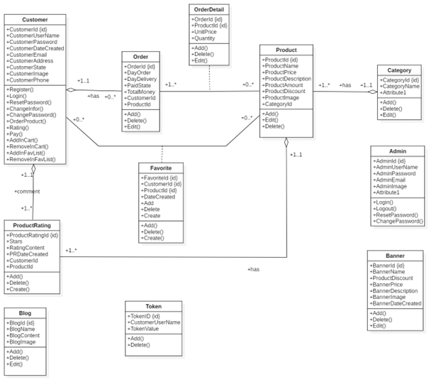

### Overview Use case

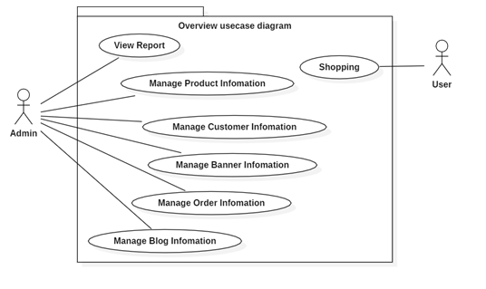

## Requirements

- C#
- Entity Framework (code first)
- Asp.net MCV Core
- Other library: pagelist, md5, mail, jquery, bootstrap, ...
- Database (MSSQL)
- API VNPAY
- Mail model
- MD5 encrypt
- signal Rm Html, css, js, Jquery

### Diagram

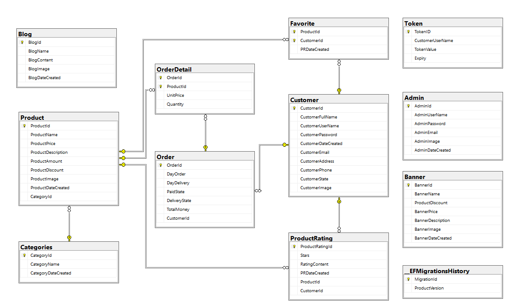

#### Interface and Function of website

##### Home page

##### Login & Register & Reset Password

| Login                                                        | Register                                                     | Reset password                                               |
| ------------------------------------------------------------ | ------------------------------------------------------------ | ------------------------------------------------------------ |
| 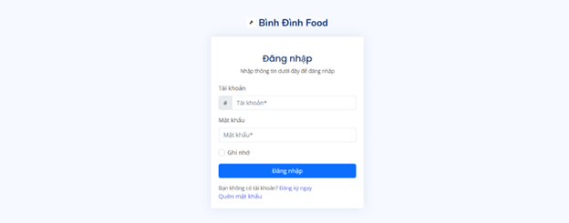 | 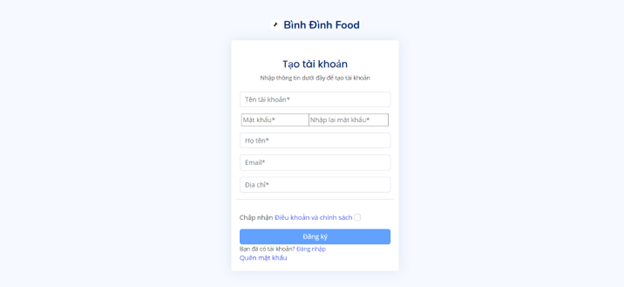 |  |

##### About us & Page not found

| About us                                                     | Contact                                                      | 404 pages                                                 | Help                                                         |
| ------------------------------------------------------------ | ------------------------------------------------------------ | --------------------------------------------------------- | ------------------------------------------------------------ |
| 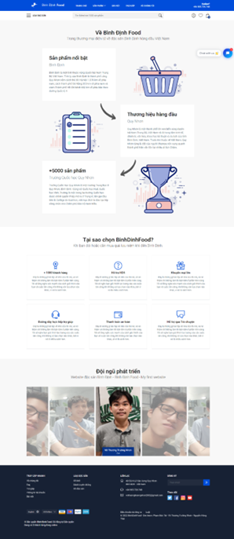 | 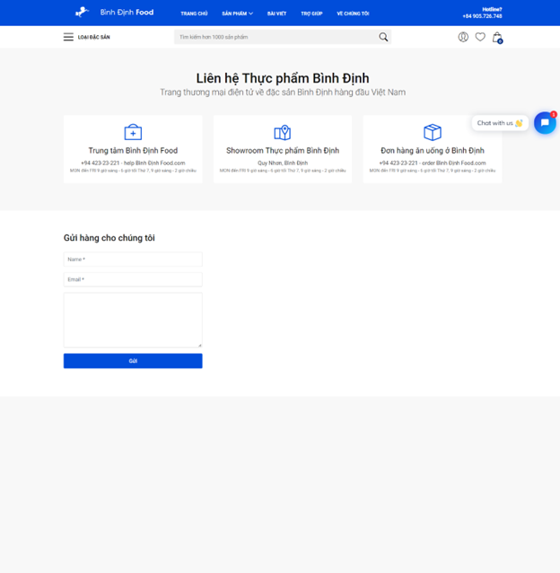 | 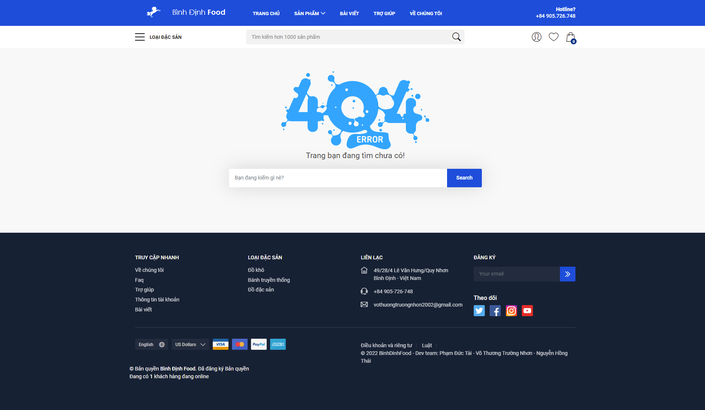 | 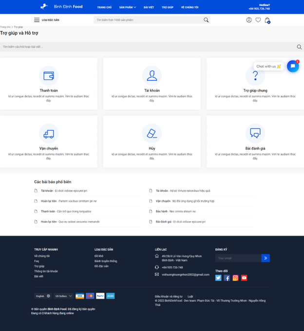 |

#### User

| USER PROFILE                                                 | EDIT PROFILE                                                 | CHANGE PASS                                                  |
| ------------------------------------------------------------ | ------------------------------------------------------------ | ------------------------------------------------------------ |
| 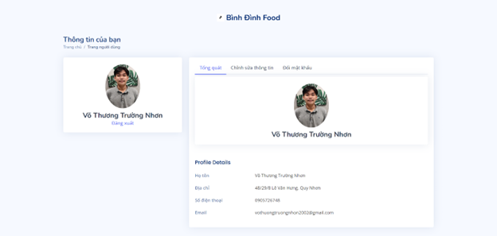 |  |  |

##### Admin

| Login                                                        | Admin forget password                                        |
| ------------------------------------------------------------ | ------------------------------------------------------------ |
|  | 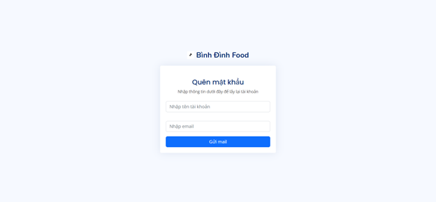 |

##### Home Page Admin

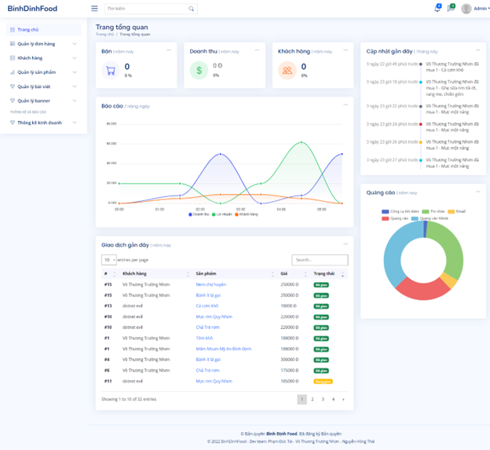

##### Admin management (C-R-U-D)

| Product                                                      | Blog                                                         | Order                                                        | Customer                                                     |
| ------------------------------------------------------------ | ------------------------------------------------------------ | ------------------------------------------------------------ | ------------------------------------------------------------ |
| 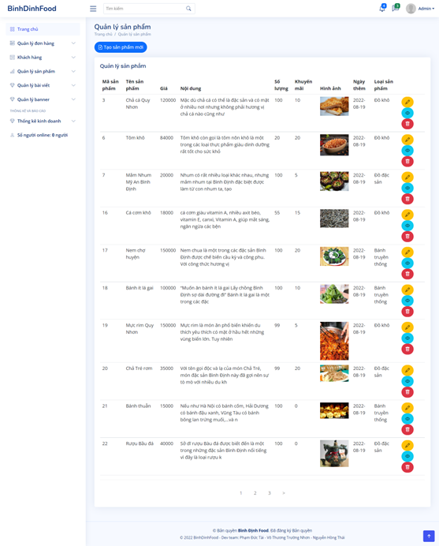 | 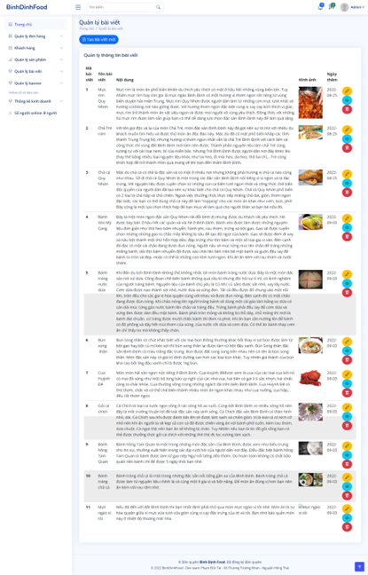 | 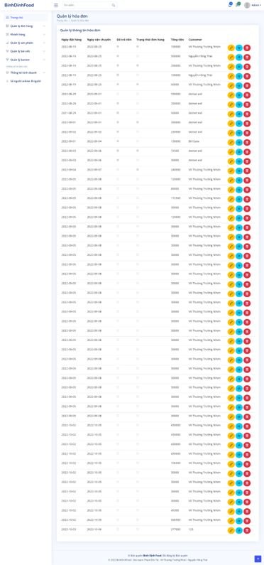 |  |

##### example: Product Management

| List film                                                    | Edit                                                         | Detail                                                       | Delete                                                       |
| ------------------------------------------------------------ | ------------------------------------------------------------ | ------------------------------------------------------------ | ------------------------------------------------------------ |
|  | 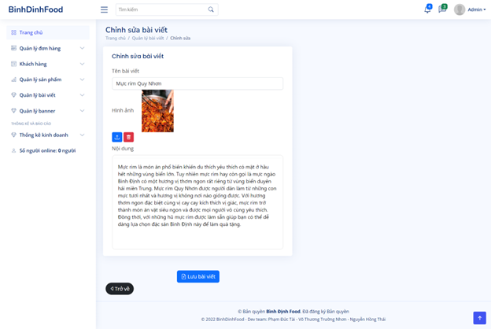 | 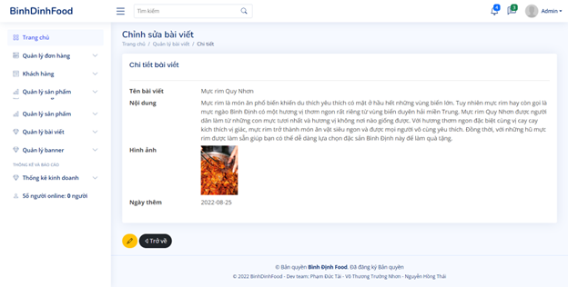 | 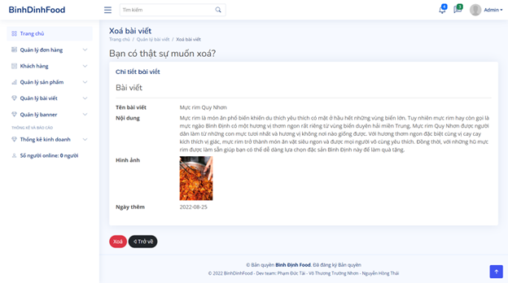 |

#### Statical and analyst

| Analyst Type of product sell in year                         | Product analyst (line chart)                                 | Product analyst (bar chart)                                  | Product sell in month                                        |
| ------------------------------------------------------------ | ------------------------------------------------------------ | ------------------------------------------------------------ | ------------------------------------------------------------ |
| 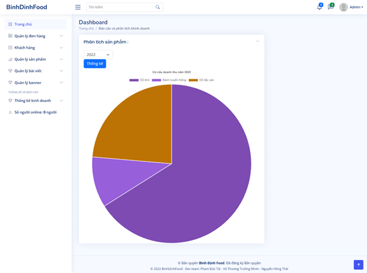 |  | 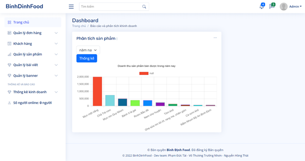 | 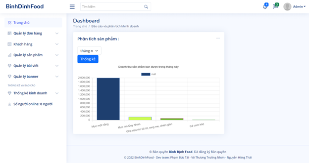 |

Above is all of function we made

Any question you can contact with us

email: <vothuongtruongnhon2002@gmail.com>

Author:

| leader                | member       | member         |
|-----------------------|--------------|----------------|
| Võ Thương Trường Nhơn | Phạm Đức Tài | Phạm Hồng Thái |

**## 👊 Ủng hộ Binhdinhfood**

\- Bằng cách ⭐️ repo này nhé! ❤️
